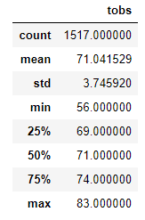
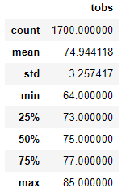

# surfs_up
## Project Overview
### Purpose
The purpose of this project was to determine the temperature statistics for the months of June and December in the island of Oahu to determine if it was feasible from a business perspective to run an ice-cream and surf shop business year round.

## Results
The analysis shows that the average temperatures in June and December are similar:
### Temperature Stats in December

### Temperature Stats in June

### Key differences in Stats between December and January
- The minimum temperature in December (56.0) is much lower than the minimum temperature in June (64.0)
- The mean temperature in December (71.0) is lower than the mean temperature in June (74.9).  Note however, that this difference does not appear to be statistically significant because the SD associated with each value is 3.7 and 3.2 degrees.
- The maximum temperature in December (83.0) is only 2 degrees lower than in June (85.0)

## Summary
The differences in temperature stats between December and June appear to be small - some are within error.  In addition the mean temperatures in both months appear to suppor the hypothesis that the temperature is high enough to keep an ice-cream and surf shop open year round.

Before making a decision to move forward, it would be informative to also collect data on other factors that may affect the desire to go surfing: for example water temperature and average number of days with swells producing surfable waves.

Two queries that could be made from the existing data that would further inform would be to determine the average precipitation for the months of June and December:

`session.query(func.avg(Measurement.prcp)).filter(func.strftime('%m',Measurement.date) == '06').all()`

`session.query(func.avg(Measurement.prcp)).filter(func.strftime('%m',Measurement.date) == '12').all()`